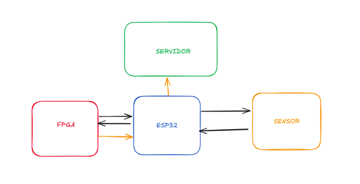
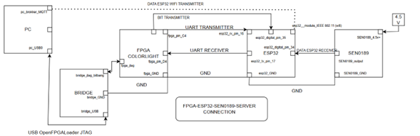
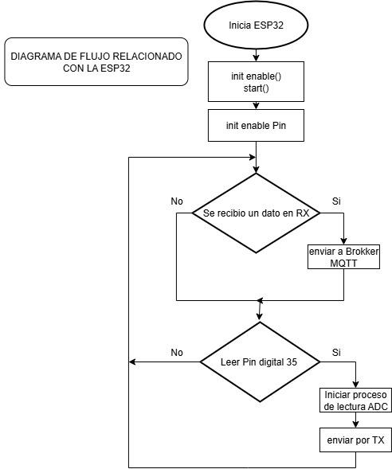
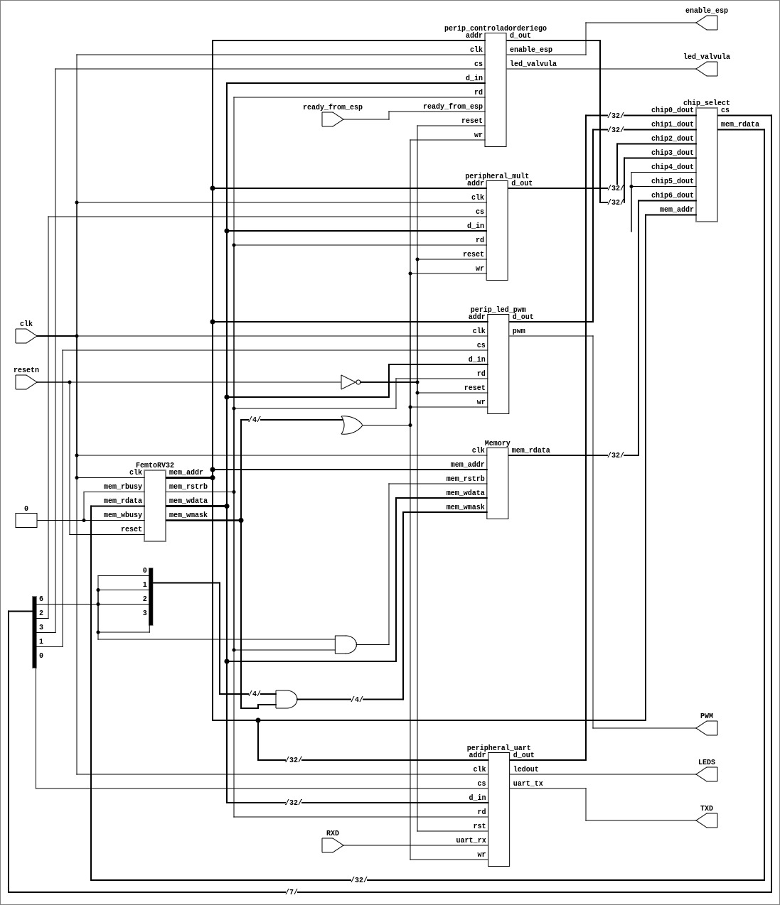
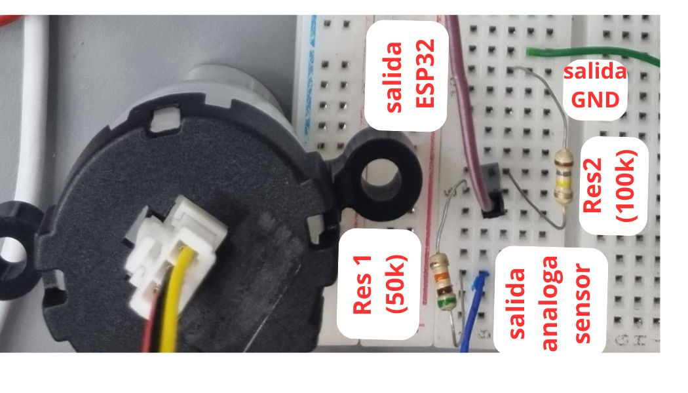

# Proyecto Electrónica Digital I  
## Sensor de turbidez de agua  

En este repositorio se explicará todo lo propuesto y desarrollado en el proyecto de electrónica digital paso a paso.

### Integrantes:
- Camilo
- Sebastián
- Kuper
- Santiago

### Descripción general
Este proyecto consiste en la medición de la turbidez de agua implementando un sensor de turbidez, una tarjeta de desarrollo ESP32 Wi-Fi, una FPGA y la transmisión de estos datos a un servidor vía Wi-Fi.

---

## Objetivo general
Diseñar un sistema de medición de turbidez de agua que obtenga datos en tiempo real, utilizando un sensor de turbidez SEN 0189, un microcontrolador ESP32, y una FPGA para procesar y analizar los datos obtenidos. Este diseño se realizó para ser escalable en las mediciones generales del agua.

## Objetivos específicos
- Diseñar un sistema con los tres componentes antes mencionados para solicitar al sensor los datos en tiempo real de la turbidez del agua y enviarlos a un servidor vía Wi-Fi.  
- Desarrollar un módulo en Verilog que implemente una máquina de estados finita para controlar la activación de una válvula según niveles de turbidez predefinidos.  
- Implementar una interfaz UART funcional en la FPGA para recibir datos de turbidez enviados por la ESP32.  
- Programar la ESP32 en MicroPython para leer valores del sensor de turbidez mediante su ADC y transmitirlos a la FPGA de forma serial.  
- Realizar pruebas funcionales y simulaciones del sistema digital completo para verificar la lógica de control, temporización y comunicación entre dispositivos.  
- Documentar detalladamente el diseño, desarrollo, pruebas y resultados del sistema, incluyendo diagramas, códigos fuente y procedimientos de carga/uso.  

---

## Descripción diagrama de caja negra
En el siguiente diagrama se muestran 4 componentes principales: un sensor de turbidez del agua, una tarjeta de desarrollo ESP32 Wi-Fi, una FPGA y un servidor receptor de datos.  

Todo inicia en la FPGA enviando una señal al ESP32; este le envía la instrucción de realizar la medición de turbidez al sensor, el ESP32 recibe el dato y lo envía a la FPGA. La FPGA convierte el dato para su lectura, análisis e interpretación, y posteriormente envía el resultado del análisis al ESP32, que finalmente transmite los datos vía Wi-Fi al servidor.

---

## Requerimientos Funcionales
- Lectura del nivel de turbidez mediante un sensor conectado a la ESP32.  
- Conversión del valor analógico del sensor a un valor digital entre 0 y 15, donde 0 representa agua clara (válvula cerrada) y 15 agua muy turbia (válvula totalmente abierta).  
- Envío del dato procesado desde la ESP32 a la FPGA utilizando comunicación UART.  
- Procesamiento del valor de turbidez en la FPGA para determinar el estado de apertura de la válvula.  
- Activación de una señal de control desde la FPGA que activa o desactiva la válvula según el nivel de turbidez.  
- Visualización del estado actual del sistema (valor de turbidez y estado de la válvula) mediante displays de 7 segmentos.  

## Requerimientos No Funcionales
- El sistema debe responder a los cambios en turbidez en un tiempo menor a 1 segundo.  
- El sistema debe ser confiable y funcionar de forma continua sin errores de comunicación ni fallas en la lógica.  
- El código debe estar documentado de forma clara para facilitar su comprensión y mantenimiento por parte de diferentes integrantes del equipo.  
- El diseño debe poder simularse digitalmente usando herramientas como Icarus Verilog y GTKWave para verificar su funcionamiento antes de ser cargado al hardware.  
- La implementación debe ser modular, permitiendo modificar o sustituir partes del sistema sin necesidad de reescribir todo el código.  

---

## Descripción diagrama de bloques

---

## Descripción de los Módulos del Sistema y sus Conexiones

### Sensor de Turbidez – SEN0189
**Función:** Detecta la cantidad de partículas suspendidas en el agua, permitiendo medir su turbidez a través de una señal analógica.  

**Conexiones:**  
- `SEN0189_output → esp32_digital_pin_34`: Salida analógica del sensor que representa el nivel de turbidez.  
- `SEN0189_4.5V+ → Fuente de alimentación de 4.5V`: Alimentación del sensor.  
- `SEN0189_GND → esp32_GND`: Tierra común con el sistema.  

### ESP32 (Microcontrolador con Wi-Fi)
**Función:** Adquiere los datos del sensor SEN0189, actúa como convertidor ADC, envía los datos a la FPGA para procesamiento, y finalmente transmite la información procesada a través de Wi-Fi hacia un broker MQTT.  

**Conexiones:**  
- `esp32_digital_pin_34 ← SEN0189_output`: Entrada analógica para la señal de turbidez.  
- `esp32_tx_pin_17 → fpga_pin_D4`: Transmisión de datos hacia la FPGA mediante UART.  
- `esp32_rx_pin_16 ← fpga_pin_C4`: Recepción de datos procesados desde la FPGA.  
- `esp32_module_IEEE 802.11 → PC (Wi-Fi)`: Envío inalámbrico de datos usando el protocolo MQTT.  
- `esp32_GND → FPGA GND y SEN0189_GND`: Tierra común para todos los dispositivos conectados.  

### FPGA COLORLIGHT
**Función:** Procesa los datos digitales enviados por el ESP32. Además, genera la señal de control que indica cuándo se debe realizar la lectura del sensor.  

**Conexiones:**  
- `fpga_pin_D4 ← esp32_tx_pin_17`: UART Receiver (recibe los datos del ESP32).  
- `fpga_pin_C4 → esp32_rx_pin_16`: UART Transmitter (devuelve los datos al ESP32).  
- `fpga_jtag ↔ bridge_jtag_bitbang`: Interfaz de programación a través del puente JTAG.  
- `fpga_GND → esp32_GND y bridge_GND`: Tierra compartida con el resto del sistema.  

### BRIDGE (Interfaz USB–JTAG)
**Función:** Permite la programación de la FPGA desde el PC mediante la interfaz JTAG, utilizando una conexión USB.  

**Conexiones:**  
- `bridge_USB ↔ PC (USB)`: Canal de comunicación para cargar configuraciones desde el PC.  
- `bridge_jtag_bitbang ↔ fpga_jtag`: Interfaz de programación JTAG.  
- `bridge_GND → fpga_GND`: Conexión de tierra compartida.  

### PC (Servidor o Cliente MQTT)
**Función:** Recibe los datos de turbidez transmitidos por el ESP32 a través de Wi-Fi usando el protocolo MQTT. También se encarga de la energización de la FPGA a través del BRIDGE.  

**Conexiones:**  
- `pc_USB0 ↔ bridge_USB`: Conexión física para la programación del FPGA.  
- `pc_broker_MQTT`: Cliente o servidor MQTT encargado de recibir y gestionar los datos enviados por el ESP32.  

---

## Diagrama de flujo ESP32

**Descripción del Diagrama de Flujo – ESP32**  
Este diagrama representa el flujo de funcionamiento lógico del microcontrolador ESP32 dentro del sistema de monitoreo de turbidez del agua.  

La ESP32 se encarga de recibir instrucciones de la FPGA, realizar lecturas del sensor de turbidez a través de su ADC, y enviar datos por UART o por Wi-Fi hacia un broker MQTT.

---

## RTL del SoC

  
Este diagrama RTL representa la estructura completa del sistema embebido (SoC) implementado en la FPGA. En él se integran los componentes fundamentales para el funcionamiento del sistema, incluyendo:

- El módulo de procesamiento central, encargado de ejecutar la lógica de control basada en los datos de turbidez recibidos.  
- Interfaces de entrada/salida, como la entrada de señal de turbidez proveniente del sensor, y salidas como la señal de activación de la válvula (`led_valvula`) y la habilitación de comunicación con el ESP32 (`enable_esp`).  
- Unidades aritméticas y lógicas, utilizadas para procesar y comparar los datos de turbidez con umbrales establecidos.  
- Multiplexores y decodificadores que seleccionan y direccionan las señales entre los distintos módulos del sistema.  
- Registros y bloques de memoria donde se almacenan valores constantes o intermedios utilizados en el control.  
- La lógica de sincronización (`clk`, `reset`) que garantiza el correcto funcionamiento secuencial del sistema.  

Este RTL muestra cómo la FPGA recibe la señal digital del sensor de turbidez, la interpreta, y en función del nivel medido, toma decisiones automáticas como habilitar o no el paso de agua mediante la válvula. Además, incluye la comunicación UART con el ESP32 para transmitir los datos recolectados, permitiendo su monitoreo remoto o procesamiento adicional.

### Adaptación de voltaje para el ADC del ESP32

La salida analógica del sensor (cable azul en la imagen) entrega una señal en el rango de 0 V a 4.5 V. Sin embargo, la entrada del ADC del ESP32 admite un máximo de 3.3 V, por lo cual conectar esta señal directamente podría dañar el microcontrolador o producir lecturas erróneas.

Para resolver este problema, se implementó un divisor resistivo compuesto por:

- Resistencia R1 = 100 kΩ conectada entre la salida del sensor y la entrada del ESP32.
- Resistencia R2 = 50 kΩ conectada entre la entrada del ESP32 y GND.

Este divisor reduce la tensión utilizando la siguiente ecuación:

Con esto se asegura que el voltaje que llega al ESP32 no supere los 3.3 V, manteniendo así la integridad del sistema.

Este tipo de adaptación es crucial cuando se conectan sensores con salida superior a 3.3 V a microcontroladores modernos, que no toleran niveles TTL de 5 V.

Imagen del montaje del divisor de voltaje:

 

